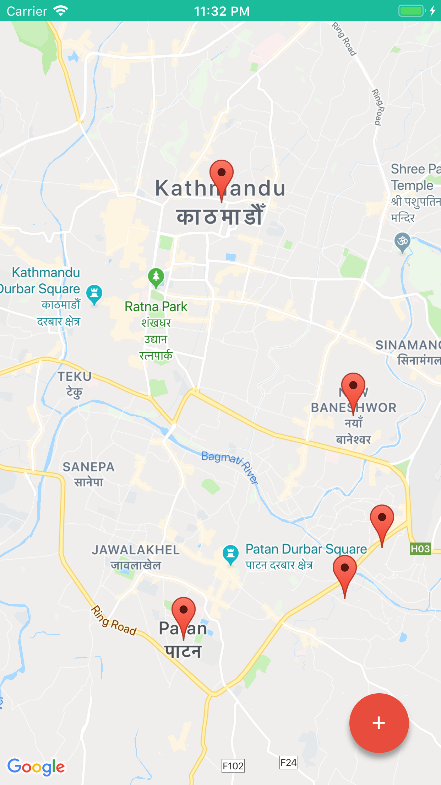
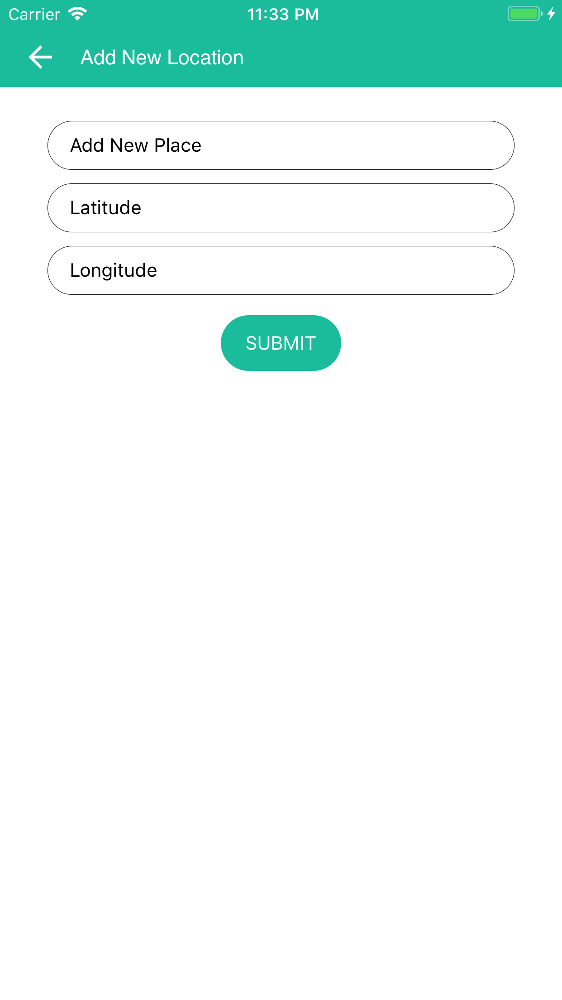
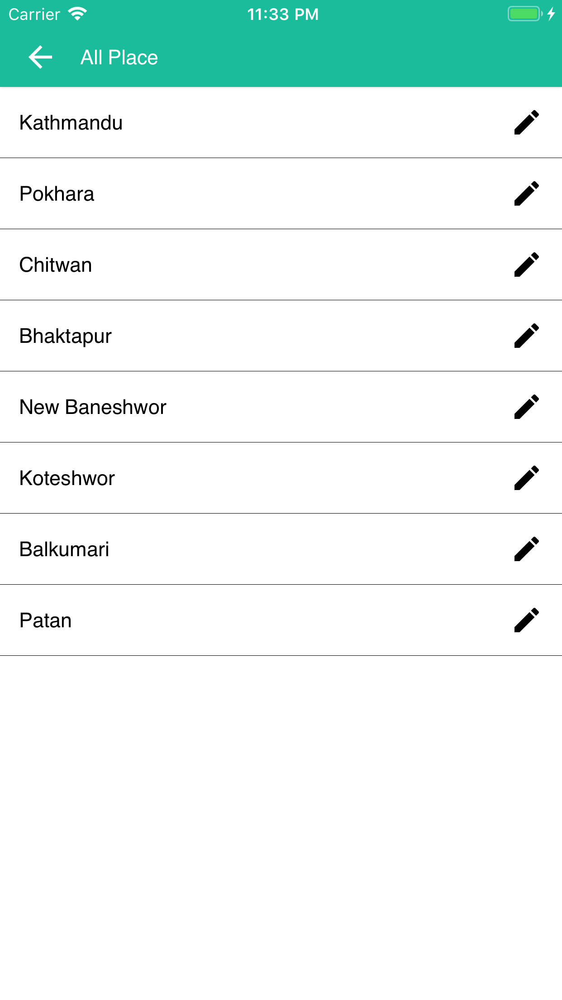
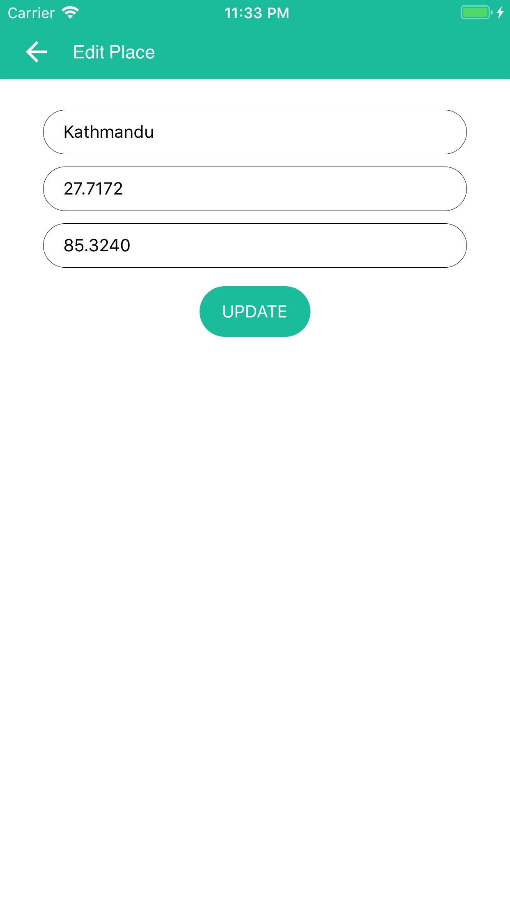
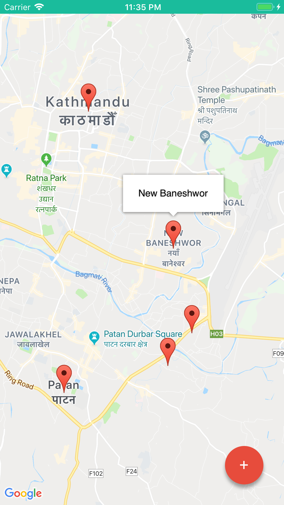

# remap


## Tech 🛠

- [React Native](https://facebook.github.io/react-native/) - native rendering
- [React Navigation](https://reactnavigation.org/) - navigation framework
- [React Native Maps](https://github.com/react-native-community/react-native-maps) - map package
- [firebase](https://firebase.google.com) - firebase database


## Building

You need to have react-native scripts installed
Fork or clone the repo and run:

```
yarn install
```

or

```
npm install
```

Here are the scripts:

`react-native run-ios` - run the native react ios app in iOS Simulator

`react-native run-android` -  run the native react android app in Android Emulator

## IOS only

The app use CocoaPods package manager to setup the react-native-maps,
you may also want to review its first - [installation guide](https://guides.cocoapods.org/using/getting-started.html)

`pod install` - run in the ios folder 

## screenshot
<p>
     
  
</p>
<p>
     
</p>
<p>
     
</p>
<p>
     
</p>
<p>
     
</p>
